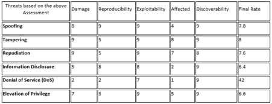
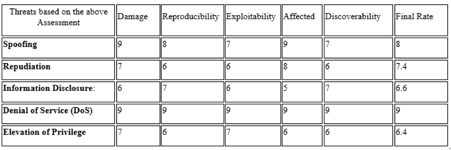

## Risk Identification Report

 Introduction
In the evolving business landscape, where technology continually reshapes consumer behaviours and market dynamics, it’s imperative for businesses to explore innovative avenues for growth. As studies have shown, Consumers are increasingly favouring the convenience of shopping from anywhere and at any time, signalling a notable departure from traditional purchasing methods that were constrained by set trading hours (Sharma, 2021). 
This report aims to outline an effective strategy for digital transformation, recognising the presence of online threat. A risk assessment will be carried out on the current business and after the digitalisation process; potential threats to the business will be identified, and strategies for mitigating these threats will be outlined.  A comprehensive list of proposed changes to transform the business will be discussed, while concurrently assessing potential risks and threats using threat modelling techniques. Moreover, how these threats can be mitigated will also be discussed, alongside a justification for these techniques and any assumptions or limitations that were considered.  
Risk Assessment of Pampered Pets before Transformation
In order to effectively carry out risk assessment on pampered pets and take into consideration possible threats, this section of the report will use Qualitative assessment to identify key areas of concern and where improvement maybe needed.  As explained by Vishal Visintine (2003, p.2) Qualitative risk assessments aim to identify and rank risks in relation to one another.  
Thus, this approach would ensure that key elements such as Asset Value, Vulnerability, Threat and Controls are recognised and addressed, as it incorporates solutions to security concerns by calculating relative risk (Vishal Visintine, 2003, p.2). 
Qualitative Risk Assessment 
Qualitative risk assessment presents results in a form of description, recommendation, where risk might arise (Artur, 2008).
Operational risk: The dependency on face-to-face sales could expose pampered pets to operational risk if local disruption occurs. This risk can be mitigated by diversifying sales channels and creating a plan to ensure business continuity during local disruptions or economic downturns.
Supply chain risk: Local suppliers are susceptible to local factors like weather or economic changes. This risk can be reduced by diversifying suppliers and ensuring the availability of ingredients.
Information security: The use of networked computer to store customer data at front desk computer could expose it to potential data breaches. This risk can be reduced by implementing data encryption and authentication measures.
Market risk: Evolving customer preference may lead to decline in foot traffic due to the lack online shopping. To address this Customer engagement must be implemented to keep up with evolving customer preference.

Threat Modelling Techniques
The following section will explore two widely used threat modelling techniques. This section will illustrate how STRIDE and DREAD can be used to identify potential threats to Pampered Pets. 
 2.1 STRIDE and DREAD
In the context of Pampered Pets, STRIDE can be used to analyse potential threats to the system by focusing on the different categories of threats and the potential associated risks, as explained by Azam et al., (2022).
Spoofing: The use of networked computer could expose Pampered pets which will give unauthorised access to sensitive data. This risk can be reduced by using encryption to secure customer data.
Tampering: The use of networked computer in the warehouse could give attacker access to tamper with sales and delivery records. To mitigate this the system should verify that the data received from any user has not been altered or tampered with (khan, 2017).
Repudiation: the attackers deny actions which have been performed such as disputing transaction or order sent by email. To address this comprehensive logging must be implemented to track actions.
Similarly, information disclosure, denial of service and elevation of privilege are further methods attackers could use to deny access and cause disruption to the system (Shostack, 2014, p. 64). To mitigate these issues is to implement intrusion detection, adequate access controls and monitor privileges.

 2.2DREAD

Based on the risk assessment and threat modelling findings, it is important to consider digital transformation and automating operational functions along with supply chain system integration, as this will have significant business benefits. 
Pampered Pets Potential Transformation
Subsequently, transitioning fully to digitalisation could introduce new risks. The objective was to perform a risk assessment using ISO/IEC 27005, which supports ISO/IEC 27001 concepts, models, and provides guidelines for implementing information security risk management for all types of organisations (ISO/IEC 27005:2018, 2020). ISO/IEC 27005 offers various advantages for the organisation since it provides a systematic approach to risk management by managing vulnerabilities and threats, implementing risk treatment options, continual communication with involved parties and a well-defined processes to monitor and review the risks (Pecb, no date). While Pampered Pets is planning to digitalise its system, the following are the main potential risks associated with it:
1.	Non-compliance with data privacy regulations (GDPR and UK Data Protection Act 2018).
2.	Increased Exposure to Cyber Threats.
3.	Challenges in Integrating with new payment gateways.
Consequently, the decision was made to use an online e-commerce system where customers access the online system and perform the entire journey from selecting items, reviewing prices, checking inventory, and confirming the order by purchasing it. STRIDE and DREAD threat modelling will be applied on the e-commerce chosen system, which involves assessing potential threats based on their types (using STRIDE) and evaluating their risk (using DREAD). Initially, we will produce a data flow diagram (DFD) to identify the customer order journey and supplier integration.
By applying STRIDE in the e-commerce system, the following are the main threats identified:
•	Spoofing: Attacker pretending to be a valid user.
•	Tampering: Unauthorised changes to data by modifying product prices or quantities.
•	Repudiation: The user denies making a purchase.
•	Information Disclosure: Unauthorised access to information where customer data, credit card information, or transaction histories are exposed.
•	Denial of Service (DoS): Making the system unavailable by overloading the website with traffic so legitimate users cannot make purchases.
•	Elevation of Privilege: Unauthorised users gaining admin rights to manage product listings.

Since we have identified the threats using the STRIDE methodology, will use DREAD to determine each threat risk score:

From the above result, Spoofing and Denial of Service threats are the highest potential risks, and to mitigate these high risks, the following will be implemented:
•	Web Application Firewall to protect the online system from DDoS attacks.
•	Implement multi-factor authentication (MFA) to make impersonation harder.
•	Use secure, time-limited session tokens to minimise the window of exposure.
•	Enable logging, monitor, and block suspicious user behaviour.

Conclusion
In conclusion, transitioning the business to an e-commerce model would facilitate business expansion by enabling access to new consumer bases in previously untapped cities and nations. Although a risk assessment does not directly contribute to corporate expansion, it establishes a fundamental basis of understanding and protection that enables a more secure establishment of ambitious growth strategies. 
Therefore, achieving a 50% growth rate can be feasible by integrating the risk assessment findings with solid business development and operational strategy. The new system will have interfaces and capabilities to integrate with multiple suppliers covering local and international suppliers with potential of 24% reduction in costs because some countries provide lower manufacturing costs, lower labour costs, and tax incentives, which is impossible with the local suppliers. 
Lastly, after COVID-19, people started trusting online shopping; according to research (Increased use of online grocery shopping ‘here to stay,’ 2021) 35% of customers shopping less in the store compared to the shopping before COVID-19. Thus, if this company does not transition to online business, it may potentially lose around 33% of its existing customers.

References

Shostack, A., 2014. Threat modeling: Designing for security. John Wiley & Sons.

Khan, S.A., 2017. A STRIDE model based threat modelling using unified and-or fuzzy operator for computer network security. International Journal of Computing and Network Technology, 5(01), pp.13-20.

Azam, N., Michala, L., Ansari, S. and Truong, N.B., 2022. Data Privacy Threat Modelling for Autonomous Systems: A Survey from the GDPR's Perspective. IEEE Transactions on Big Data.

Artur Rot, 2008. IT Risk Assessment: Quantitative and Qualitative Approach. the World Congress on Engineering and Computer Science 2008 WCECS 2008, October 22 - 24, 2008, San Francisco, USA
Sharma, S., 2021. Modeling the role of information on the spread of online shopping. Computational and Mathematical Methods, 3(5), p.e1182.
Vishal Visintine. 2003. An Introduction to Information Risk Assessment. GSEC Practical, Version 1.4b
ISO/IEC 27005:2018 (2020). Available at: https://www.iso.org/standard/75281.html.
Pecb (no date) ISO/IEC 27005 Information Security Risk Management - EN | PECB. Available at: https://pecb.com/en/education-and-certification-for-individuals/iso-iec-27005.
Increased use of online grocery shopping ‘here to stay’ (2021). Available at: https://www.supermarketnews.com/online-retail/increased-use-online-grocery-shopping-here-stay.

---

