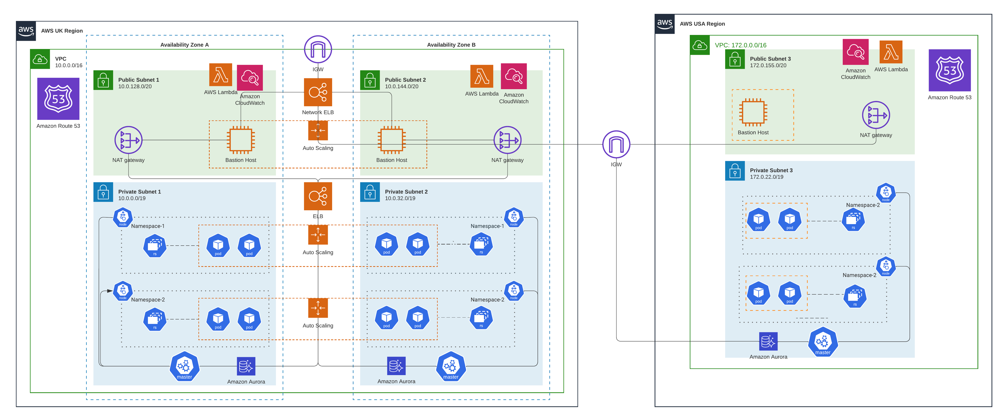

## Security And Risk Management

# Introduction

In the contemporary era of digitalization, there has been a swift and widespread integration of digital technologies, leading to a significant shift in company operations from manual and labor-intensive procedures to automated and structured processes. The prominence of security and risk management has become paramount, exerting a significant influence on the operations of enterprises, governments, and individuals.

During the course of my academic studies in the security and risk management module, we extensively examined multiple definitions of risk. Additionally, we employed numerous risk assessment approaches to evaluate, categorize, and mitigate risks within the context of projects and team discussions for the entirety of the module.

This reflective analysis aims to examine my understanding, individual development, and the consequences associated with security and risk management.

# Modules Overview

Throughout the team communication, I made a significant contribution by actively engaging in extended deliberations. I demonstrated my practical understanding regarding the substantial ramifications of the Industry 4.0 revolution and its revolutionary consequences on organizational operations. The adoption of business transformation techniques has proven to be advantageous. However, it is important to acknowledge that this implementation also increases the potential risks that organizations may encounter if they fail to adequately examine information security measures and legislation.

While progressing through module topics, develop a solid understanding of the Risk Management Process (RMP) and distinguish between the types of risk assessments and the role of user participation in the process. In my research of this topic, I examined each type of assessment in depth. The qualitative risk assessment involves the evaluation of risks categorized as minimal, medium, or major. Furthermore, Quantitative assessments involve the utilization of statistical or historical data in order to evaluate and assign a numerical value to a risk (*Qualitative vs. Quantitative Risk Assessment*, 2021). Given the ease of implementation and adherence, qualitative risk assessment holds particular significance for organizations in their initial stages of risk assessment. Consequently, it was imperative within this module to go further into quantitative assessment methodologies and expound upon several techniques of this nature. The subsequent discussion pertained to the investigation of threat modeling, which involved an evaluation of vulnerabilities, threat definitions, and various methodologies for threat modeling. Additionally, practical application of specific techniques such as STRIDE and DREAD was undertaken. Which significantly increased my understanding of employing diverse risk assessment methodologies to generate a comprehensive risk report for commercial purposes.

In this module, i have examined a compilation of prevalent information security and data protection standards and frameworks, including the ISO 27000 series, NIST, GDPR, and COBIT. While these standards ensure that organizations can refer to specific best practices and recommended measures that are beneficial to implement for enterprises. However, certain regulations require organizations to implement required controls if they are relevant to their business. In the event of non-compliance, the government may impose fines on the corporation, resulting in financial repercussions for the organization.

A comprehensive examination was conducted on the subject of Disaster Recovery (DR), with a subsequent analysis of the influence that Recovery Point Objective (RPO) and Recovery Time Objective (RTO) values have on the execution of DR strategies. Furthermore, it is essential to acknowledge the significant role that information security plays in mitigating risks and enhancing the recovery process in the event of a security incident.

# Projects Reflections

The module's project was divided into two primary tasks, which demanded the submission of two reports pertaining to the digital and automated transformation of the Pampered Pets enterprise. Where I was part of delivering the use case reports in collaboration with my group members. In the initial assignment, our team was tasked with preparing a report for a firm that is contemplating a business transformation through the implementation of an online e-commerce shop and the integration of digital technologies to streamline its supply chain operations. This report serves as a practical exercise aimed at delivering a risk assessment report that focuses on the analysis and identification of business risks in the context of digital transformation. In this section, qualitative analysis was applied to emphasize the risks associated with the business. Additionally, threat modeling analysis was conducted utilizing two approaches, including STRIDE and DREAD. The assessment of the possible digitalization process was conducted in accordance with ISO 27005 and GDPR standards, using threat modeling research. This experience has significantly influenced my comprehension of these standards and their practical application. Particularly interesting was the integration of two threat modeling methods, particularly STRIDE and DREAD, to evaluate potential threats based on their types and assess their associated risk scores. This integration has proven to be a valuable source of knowledge and learning for me. 

As part of the module development, our team was tasked with evaluating the company's decision to implement a digitalization transformation strategy. This assessment involved conducting a quantitative risk assessment using the Multiple Criteria Decision Analysis (MCDA) tool. The purpose of this tool was to evaluate various criteria in the decision-making process, identify risks, and prioritize them based on available information. Through a weighted assessment, we were able to analyze potential risks and determine their relative importance and ranking.  

Furthermore, in the given scenario, the primary stakeholder involved in the company's transformation has expressed the need for a robust disaster recovery strategy that can effectively mitigate any disruptions to business operations, ensuring that downtime does not exceed one minute. Therefore, our team and I initially conducted research to identify the most optimal technologies and platforms that would facilitate the timely and cost-effective attainment of our objectives. The utilization of cloud technologies enables the exploration of their extensive potential, characterized by their ability to scale and incorporate built-in platforms that facilitate high availability and automatic scaling systems. These capabilities span across various regions, thereby facilitating the establishment of a robust infrastructure that supports online shopping with a high level of availability. This infrastructure aims to achieve a recovery point objective (RPO) and recovery time objective (RTO) of less than one minute.

Finally, I have conducted an analysis and engaged in discussions with the team regarding the prospective security trends and risks in light of recent advancements in technology, particularly the disruptive impact of Artificial Intelligence (AI) and Machine Learning on the overall industry. Additionally, we have examined how systems have assumed a more significant role in business deliberations. This inquiry pertains to the potential impact of a specific factor on cybersecurity risks, as well as the appropriate measures to address such risks.

# Summary

In summary, the security and risk management module has significantly influenced my understanding and cognitive approach towards risk assessment. This was achieved through engaging in discussions and actively implementing various risk assessments within practical scenarios. Additionally, the individual's contributions have facilitated the comprehension of novel technologies and methodologies for addressing the aforementioned hazards. This underscores the need of conducting early risk assessments for new projects and consistently undertaking risk assessments throughout the business lifecycle, as it enables organizations to effectively pursue their objectives while minimizing disruptions.

# References

*Qualitative vs. Quantitative Risk Assessment* (2021). https://www.isaca.org/resources/news-and-trends/isaca-now-blog/2021/qualitative-vs-quantitative-risk-assessment.

# Artifacts

Assigement 1

Threat Modelling:

Assigement 2
Disaster Recovery Design (AWS-DR):

